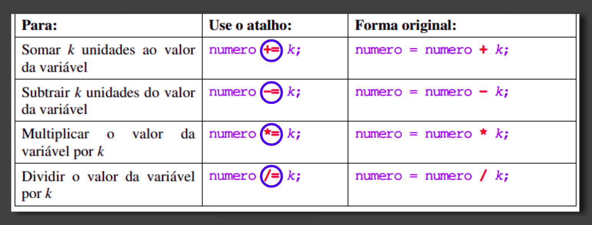

# 📌 **Estruturas de Repetição**

## ✅ Conceituação
O real poder dos computadores está na sua habilidade para
repetir uma operação ou uma série de operações várias vezes.

● Cada repetição é chamada laço (loop) é um dos conceitos
básicos da programação estruturada.

● Uma estrutura de repetição permite que uma sequência de
comandos seja executada repetidamente, caso determinadas
condições sejam satisfeitas.

● Essas condições são representadas por expressões lógica.

● As estruturas de repetição podem ser classificadas em:

    ○ Repetição com teste no início (while)
    ○ Repetição com teste no final (do-while)
    ○ Repetição contada (for)

● O comando break é utilizado para terminar de forma abrupta
uma repetição.

● Quando o comando continue é executado, os comandos
restantes da repetição são ignorados e o programa volta a testar
novamente ou não.

 

## ✅ Estrutura

 

## ✅ ➕/➖ Operadores de Incremento e Decremento

 

## ✅ 🧮 OPERAÇÕES ARITMÉTICAS

 