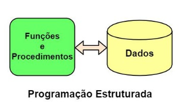
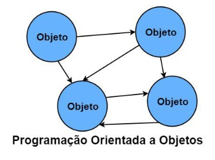

# 📌 **Programação Orientada a Objetos**
## 📝 **Por que usar ?**

### ✅ **PE(Paradigma Estruturado) vs POO(Paradigma Orientado a Objeto)**

 

### **Paradigma Estruturado**
- Paradigma Estruturado tem uma representação mais simplista;

- Paradigma Estruturado foca em operações(funções) e dados;

- Programação Estruturada foca mais no "como fazer";

 

### **Paradigma Orientado a Objeto**
- Paradigma Orientado a Objeto tem uma representação mais
realista;

- Paradigma Orientado a Objetos foca na modelagem de
entidades e nas interações entre estas;

- Programação Orientada a Objetos foca mais no "o que fazer";

 

### ✅ **Vantagens da POO**

- Melhor coesão

- Melhor acoplamento

- Diminuição do Gap semântico

- Coletor de lixo

 

 

