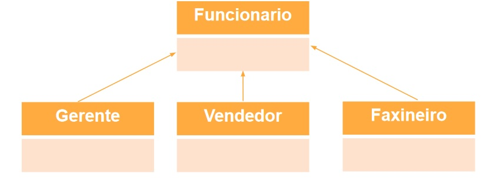

# 📌 **Programação Orientada a Objetos**
## 📝 **Herança**

## 🏆 **Exercício 02**
Crie as classes "Funcionario", "Gerente", "Vendedor" e "Faxineiro". Realize upcasts e downcasts.

Obs: use a linguagem que gostar e siga as dicas sobre como criar classes. Faça a relação de herança de acordo com o slide.

