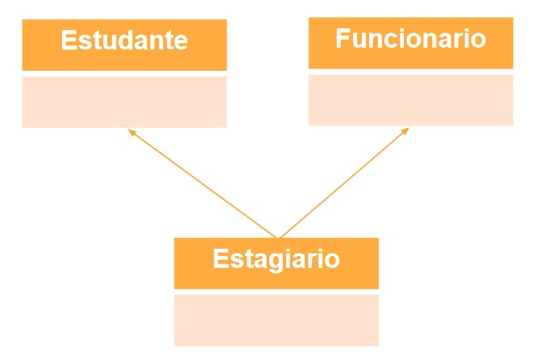
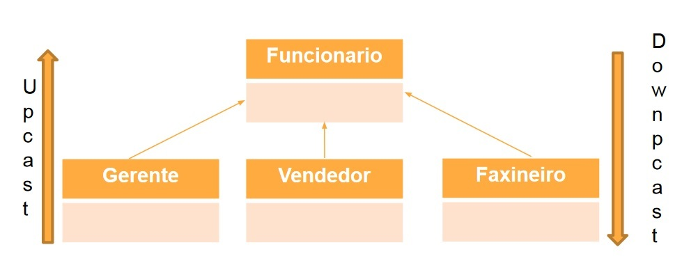
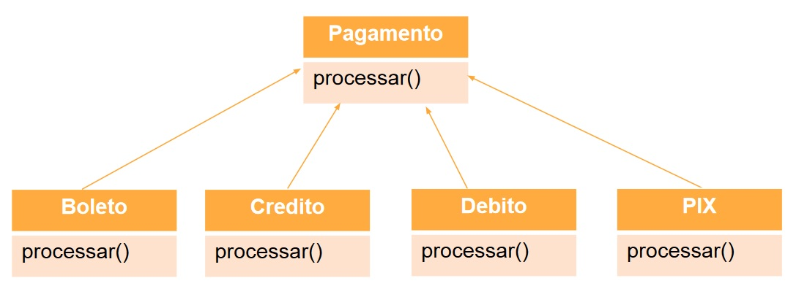
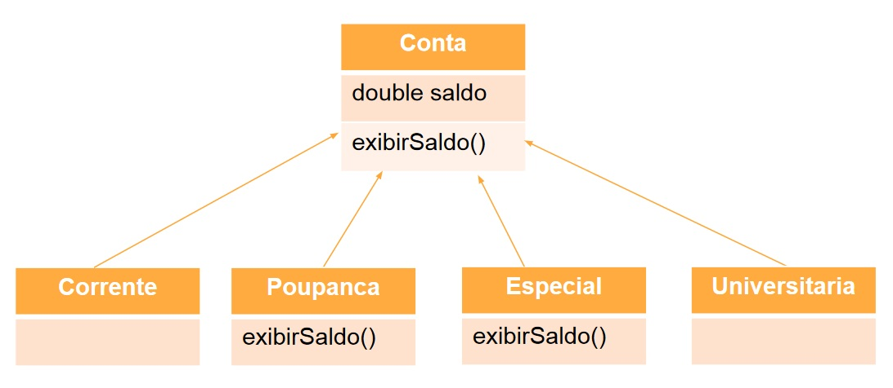

# 📌 **Programação Orientada a Objetos**
## 📝 **Herança**

<br>

## 🎯 **Objetivos**
Apresentar os conceitos que ajudam a criar entidades a partir
de outras entidades:
- Herança
- Associação
- Interface

<br>

## ✅ **Definição**
É o relacionamento entre classes em que uma classe chamada
de subclasse (classe filha, classe derivada) é uma extensão, um subtipo, de outra classe chamada de superclasse (classe pai, classe mãe, classe base). Devido a isto, a subclasse consegue reaproveitar os atributos e métodos dela. Além dos que venham a ser herdados, a subclasse pode definir seus próprios membros.

### **Código**
```
// Java
class A extends B {
    ...
}

// C#
class A : B {
    ...
}

// Python
class A(B):
    ...
```

<br>

## ✅ **Tipos**
### **Herança Simples**
A classe filha tem só uma classe mãe
<br>


### **Herança Múltipla**
A classe filha tem uma ou mais classes mães
<br>



### **Código**
```
// Java não possui herança multipla

// C# não possui herança multipla

// Python
class A(B, C) :
    pass
```

<br>

## ✅ **Upcast e Downcast:**



### **Upcasting**
Upcasting é fazer um objeto se passar por um objeto que seja um supertipo dele. Ele sempre funcionará já que todo objeto é completamente compatível com um tipo do qual ele foi derivado. Como sempre pode ser realizado, é possível fazer implicitamente, ou seja, o compilador faz por você quando for necessário.

É muito comum ele ocorrer como parâmetro de um método que usará polimorfismo. O chamador manda como argumento um objeto que é o subtipo, o método recebe um parâmetro como se fosse o supertipo, mas funciona como um subtipo. Mas note que o polimorfismo é um mecanismo auxiliar e não ligado diretamente ao casting. É considerado uma coerção em tempo de compilação.

Algumas pessoas gostam de chamar de promoção de tipo.

### **Downcasting**
Downcasting é quando o objeto se passa como se fosse um subtipo dele. Não há garantias que funcione (pode lançar uma ClassCastException, o que obviamente é um erro de programação) e pode haver necessidade de conversões. O compilador só aceita se ele puder provar que o objeto se encaixará perfeitamente e seja de fato aquele objeto. Por isso deve ser explicitado pelo programador quando deseja essa ação. A coerção ocorre em tempo de execução.

Algumas pessoas gostam de chamar de demoção de tipo (apesar de ser um neologismo).

Existe um padrão normalmente usado para evitar a exceção quando não se tem certeza que dará certo:
```
obj instanceof Tipo ? (Tipo)obj : null
```
Nesse exemplo se o objeto não for do tipo adequado, ele criará um nulo e nem tentará o cast. Obviamente que qualquer tentativa de acesso ao objeto gerado será problemático, então é preciso verificar se o objeto é nulo antes de tentar acessá-lo, caso contrário, só trocará de erro.

```
class Animal { 
    public void fazBarulho() {
        System.out.println("silêncio");
    }
}
class Dog extends Animal { 
    public void fazBarulho() {
        System.out.println("au au");
    }
}
class Cat extends Animal { 
    public void fazBarulho() {
        System.out.println("miau");
    }
}
class Ideone {
    public static void main(String[] args) {
        Dog dog = new Dog();      
        Animal animal = new Animal();
        Animal animal2 = new Dog();
        Animal animal3 = new Cat();
        dog.fazBarulho();
        animal.fazBarulho();
        animal2.fazBarulho(); //concretamente é um cachorro
        animal3.fazBarulho(); //concretamente é um gato
        System.out.println("-- Castings agora --");
        ((Animal)dog).fazBarulho(); //upcasting
        ((Dog)animal2).fazBarulho(); //downcasting, funciona
        ((Dog)animal3).fazBarulho(); //downcasting, dá erro porque um gato não é um cachorro
        ((Dog)animal).fazBarulho(); //downcasting, dá erro aqui
    }
}
```
Quando não há garantias que o objeto terá tudo o que se espera daquele tipo, o cast falhará. É o caso óbvio de um gato tentando se passar por um cachorro. Quando o animal genérico tenta se passar por um cachorro também não dá. Embora coincidentemente nesse exemplo até poderia funcionar, o compilador não pode provar isto. O programador que está vendo todo o código sabe, mas nem sempre ele poderá ver todas as classes. E mais, é possível uma manutenção modificar a classe e o que funcionava deixar de funcionar. Então tem que ir pelo caminho seguro.

De uma maneira geral isto funciona igual em todas as linguagens que possuem herança.

Link da Fonte: https://pt.stackoverflow.com/questions/131091/o-que-%C3%A9-upcasting-e-downcasting-na-linguagem-java

<br>

### **Código**
### Upcast
```
// Java
A a = new B ();

// C#
A a = new B ();

// Python não utiliza
```

### Downcast
```
// Java
B b = (B) new A ();

// C#
B b = (B) new A ();

// Python não utiliza
```

<br>

## ✅ **Polimorfismo e Sobrescrita**
### Polimorfismo
*A mesma ação, se comportando diferente.*

Polimorfismo significa "muitas formas", é o termo definido em linguagens orientadas a objeto, como por exemplo Java, C# e C++, que permite ao desenvolvedor usar o mesmo elemento de formas diferentes. Polimorfismo denota uma situação na qual um objeto pode se comportar de maneiras diferentes ao receber uma mensagem.



<br>

### Sobrescrita
*A mesma ação, podendo se comportar diferente.*

A Sobrescrita de Métodos pode ser classificada como polimorfismo de inclusão. Quando um método sobrescreve um método herdado de uma classe, temos uma sobrescrita de método. Este método de sobrescrita tem que ser idêntico ao método da classe herdada, ou seja, eles precisam ter o mesmo nome, valor de retorno e argumentos. Portanto, temos que uma classe filha fornece apenas uma nova implementação para o método herdado e não um novo método. Por exemplo, temos uma superclasse Forma e as suas subclasses Triangulo e Circulo. Digamos que a superclasse Forma tem um método chamado calculaArea(). Cada uma das subclasses Triangulo e Circulo definirá o seu próprio método calculaArea(). Dependendo do tipo de objeto que for criado teremos a execução do método dessa subclasse.

Se a classe filha fornecer um método de cabeçalho ou assinatura parecida com a do método herdado (difere ou no número ou no tipo dos argumentos) então não se trata mais de redefinição, trata-se de uma sobrecarga, pois criou-se um novo método. Uma chamada ao método herdado não mais será interceptada por esse novo método de mesmo nome. O método tem o mesmo nome, mas é ligeiramente diferente na sua assinatura (o corpo ou bloco de código não importa), o que já implica que não proporciona o mesmo comportamento do método da superclasse. Por exemplo, se temos um método soma que aceita um inteiro como parâmetro e um outro método soma que recebe dois parâmetros inteiros. O método que será chamado depende dos argumentos sendo passados na chamada deste método, portanto, se chamarmos soma(1,3) o segundo método será chamado.

O tipo de polimorfismo de Sobrecarga permite a existência de vários métodos de mesmo nome, porém com assinaturas levemente diferentes, ou seja, variando no número e tipo de argumentos. Ficaria a cargo do compilador escolher de acordo com as listas de argumentos os procedimentos ou métodos a serem executados.

Sobrecarga de Métodos é comumente usada nos construtores de uma classe Java.



Link da Fonte: https://www.devmedia.com.br/uso-de-polimorfismo-em-java/26140#:~:text=Polimorfismo%20significa%20%22muitas%20formas%22%2C,diferentes%20ao%20receber%20uma%20mensagem.