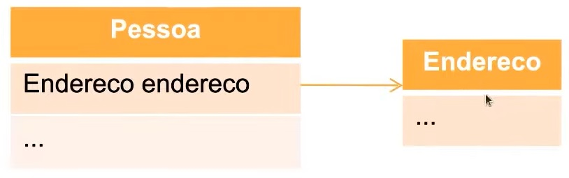
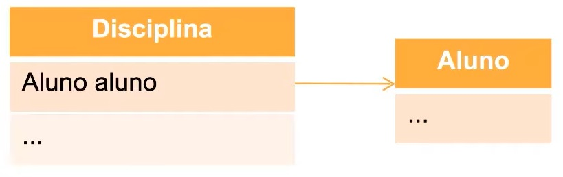
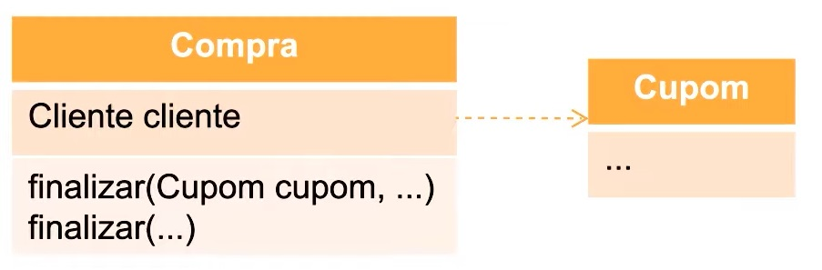

# 📌 **Programação Orientada a Objetos**
## 📝 **Associação**

<br>

## ✅ **Definição**
Possibilita um relacionamento entre classes/objetos, no qual estes possam pedir ajuda a outras classes/objetos e representar de forma completa o conceito ao qual se destinam. Neste tipo de relacionamento, as classes e os objetos interagem entre si para atingir seus objetivos.

<br>

## ✅ **Tipos**
### Estrutural
- Composição
- Agregação
### Comportamental
- Depêndencia

<br>

### Composição
Relacionamento entre um elemento ( o todo) e outros elementos (as partes) onde as parte só podem pertencer ao todo e são criadas e destruídas com ele.

- Composição: "Com Parte Todo"
- Ex: Pessoa e Endereço



### Código
```
// Java
class Pessoa {
    Endereco endereco;
}
```

<br>

### Agregação
tipo de associação ( é parte de , todo/parte) onde o objeto parte é um atributo do todo ; onde os objetos partes somente são criados se o todo ao qual estão agregados seja criado. Pedidos é composto por itens de pedidos.

- Composição: "Sem Parte Todo"
- Ex: Disciplina e Aluno



### Código
```
// Java
class Disciplina {
    Aluno aluno;
}
```

<br>

### Depêndencia
São relacionamentos de utilização no qual uma mudança na especificação de um elemento pode alterar a especificação do elemento dependente. A dependência entre classes indica que os objetos de uma classe usam serviços dos objetos de outra classe.

- Composição: "Depende de"



### Código
```
// Java
class Compra {
    ...
    finalizar(Cupom cupom, ...) {
        ...
    }
}
```

## Herança x Associação
Não faz sentido polarizar e afirmar que você deve usar uma em detrimento a outra. Associação e herança podem coexistir cada qual com seu caso de uso. Por outro lado, o uso de associação é sempre encorajado. Não exatamente no sentido de fazer o desenvolvedor “parar” de usar herança, mas no sentido de que, tendo mais objetos inter-relacionados (não no sentido de quantidade, mas no de qualidade de comportamento), as responsabilidades são melhores delegadas, favorece o reuso, a refatoração, a testabilidade e até mesmo a mudança de associação em tempo de execução.

Muitos objetos dificultam o relacionamento e até mesmo o gerenciamento deles como dependências e o código fica bem menos estático (menos previsível). No entanto, há mecanismos que nos ajudam bastante na resolução desses problemas.

Uma coisa é a outra?

- se sim, pode-se utilizar herança.
- se não, deve-se utilizar associação.

